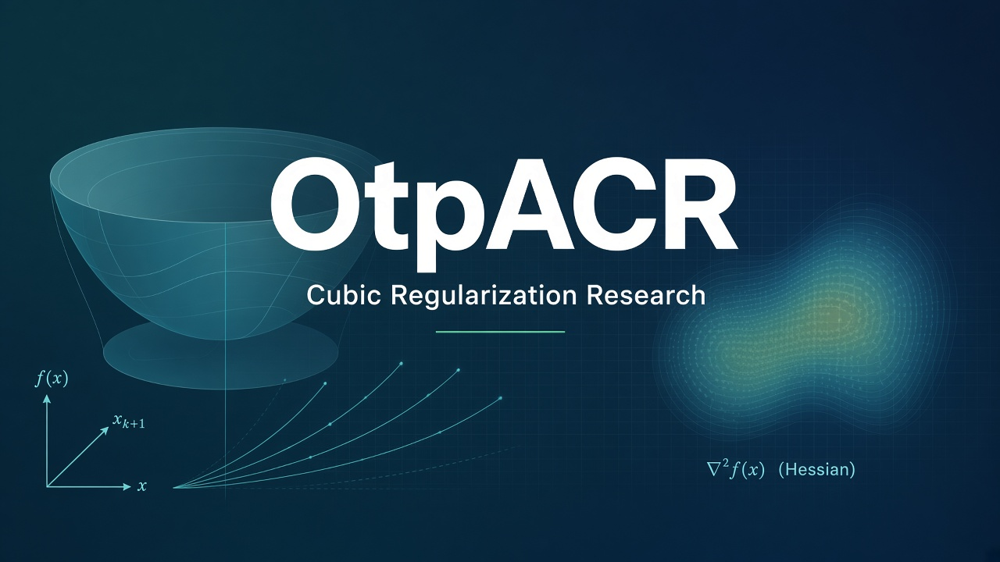

<p align="center">
  
</p>

<h1 align="center">otpACR</h1>

<p align="center">
  <strong>Improving Nesterov's Cubic Regularization</strong><br/>
  Adaptive inexact Krylov methods · ARC · reproducible experiments · bilingual research papers
</p>

<p align="center">
  <a href="papers/en/main.pdf">English PDF</a> ·
  <a href="papers/ar/main.pdf">Arabic PDF</a> ·
  <a href="تقرير_النتائج.md">Arabic results report</a>
</p>

---

## Overview

Python research framework for **Nesterov cubic regularization (CR)** and seven improvement axes:

| # | Axis | Module |
|---|------|--------|
| 0 | Baseline CR | `cubic_reg/solvers/cr.py` |
| 1 | Krylov / Lanczos (HVP) | `cubic_reg/solvers/krylov.py` |
| 2 | ARC (adaptive \(M\)) | `cubic_reg/solvers/arc.py` |
| 3 | Quasi-Newton / L-BFGS hybrids | `cubic_reg/solvers/quasi_newton.py` |
| 4 | Accelerated CR | `cubic_reg/solvers/accelerated.py` |
| 5 | Stochastic / subsampled | `cubic_reg/solvers/stochastic.py` |
| 6 | Tensor order-3 | `cubic_reg/solvers/tensor.py` |
| 7 | Distributed sketch | `cubic_reg/solvers/distributed.py` |

**Headline empirical takeaway (MNIST softmax, \(d=7840\)):** ARC–Krylov is strongest on \(f\) / \(\|\nabla f\|\); L-BFGS is fastest; validation early stopping lifts test accuracy from ~87% to ~90%.

## Setup

```bash
pip install -r requirements.txt
pip install -e .
pytest -q
```

## Quick start

```python
from cubic_reg.problems import Quadratic
from cubic_reg.solvers import cr, arc, krylov

p = Quadratic(n=50, condition=100.0)
res = cr.minimize(p, x0=None, M=1.0, eps=1e-6)
print(res.nit, res.grad_norm, res.time_sec)
```

## Reproduce experiments

```bash
python experiments/run_baseline.py
python experiments/run_all.py
python experiments/run_phase3.py   # … through run_phase10.py
python experiments/run_phase10.py --quick
# Full MNIST (~60k): python experiments/run_phase10.py --full
```

Figures land in `experiments/figures/` (`00`–`27`). JSON logs in `experiments/results/`.

## Research papers (LaTeX + PDF)

| Language | Source | PDF |
|----------|--------|-----|
| English | [`papers/en/main.tex`](papers/en/main.tex) | [`papers/en/main.pdf`](papers/en/main.pdf) |
| Arabic | [`papers/ar/main.tex`](papers/ar/main.tex) | [`papers/ar/main.pdf`](papers/ar/main.pdf) |

```bash
cd papers/en && xelatex -interaction=nonstopmode main.tex && xelatex -interaction=nonstopmode main.tex
cd ../ar && xelatex -interaction=nonstopmode main.tex && xelatex -interaction=nonstopmode main.tex
```

Papers include theorems/proofs (global CR rate, accelerated CR, ARC complexity, adaptive inexact Krylov) plus MNIST tables and figures.

## Layout

```
otpACR/
  assets/banner.png
  cubic_reg/           # package
  notebooks/           # 00–07 + summary
  experiments/         # phase scripts, figures, results
  papers/{en,ar}/      # LaTeX + PDF
  tests/
  تقرير_النتائج.md
  خطة_تحسين_النموذج_التكعيبي.md
```

## License

MIT — research / educational use.
